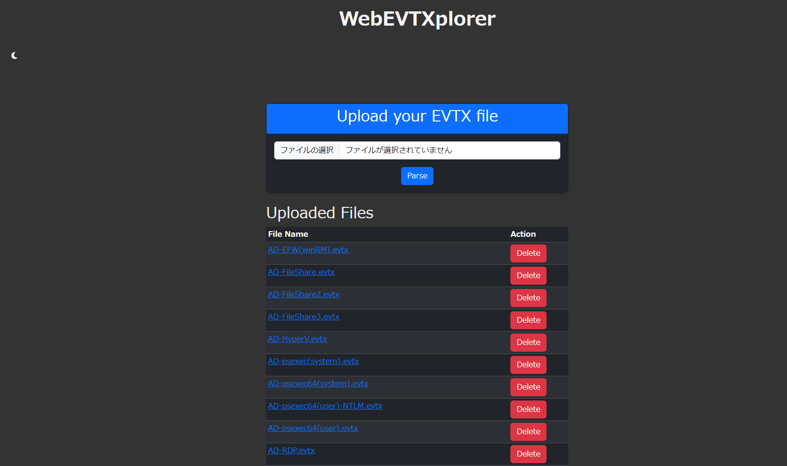
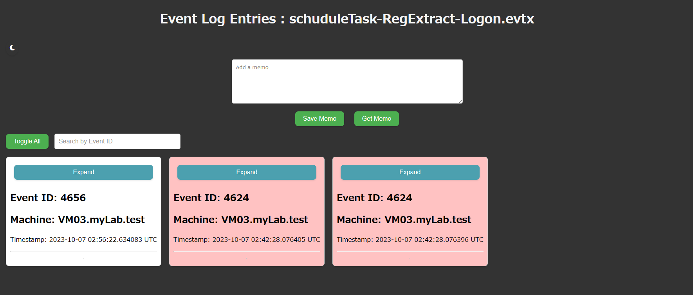

# WebEVTXplorer

WebEVTXplorer is a web application that reads Windows OS event logs and displays each event as a card.






**Note** 
+ This application is intended for use in a local network environment only.
+ It may not be possible to load events recorded in Forwarded Events.

## Usage
To run the application, use the following command:

```bash
pip install requirements.txt
python app.py
```

## Requirements
Make sure you have the following Python libraries installed:
- Flask
- evtx

## Features
- Display event logs as cards with sortable options.